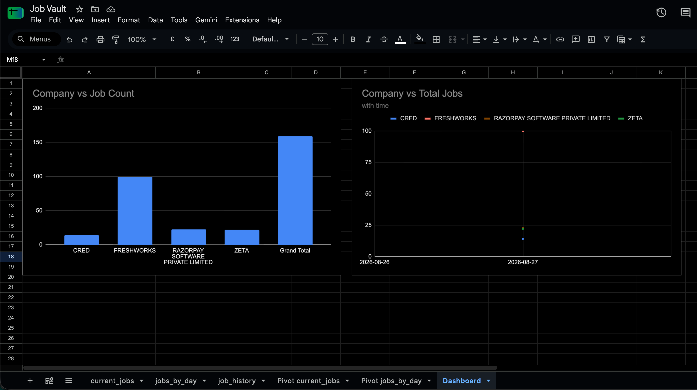

# 🏆 JobVault — A Local Data Vault Pipeline for Job Postings

> **Scrape real job postings from multiple websites → normalize them into one schema → keep full change history → push to a live Google Sheets dashboard. All on your laptop, no cloud.**

    

---

## 📸 Live Dashboard

Here is the dashboard, fed automatically every day:



> 📊 **View the live, interactive dashboard here:**
> **[Open in Google Sheets →](https://docs.google.com/spreadsheets/d/1lytBBMa1yk0I-2F4WUoC7el9EH1ch5h7KsUm1-XNr48/edit?usp=sharing)**
> *(Tip: set the sheet's sharing to "Anyone with the link → Viewer" so visitors can open it.)*

The dashboard is **not a static screenshot** — the data pipelines into all three tabs daily, and charts update automatically. This is a working system, not a one-time analysis.

---

## ✨ What It Does

| 🇪🇺 | Capability |
|--------------|--------------------------------------------------------------|
| 🌐 | **Multi-source scraping** — pulls live jobs from 4 different company career-site APIs |
| 🧼 | **Normalized schema** — each site's different format mapped to ONE standard shape |
| 🔑 | **MD5 content-based keys** — same company matches across sources with zero manual mapping |
| 🕰️ | **Append-only history** — every change to every posting is kept forever, never overwritten |
| 🕒 | **Fully automated** — a daily 9 PM batch runs the whole pipeline hands-free |
| 📈 | **Live dashboard** — Google Sheets + charts that auto-refresh every day |
| 📦 | **100% local** — Python + SQLite, no cloud, no paid services |

---

## 🧠 What Problem Does It Solve?

Different job sites live in different worlds:

- 🏦 Razorpay uses **Greenhouse** → `{"company_name": "Razorpay Software...", "id": 4718628005}`
- 💳 CRED & Zeta use **Lever** → different fields, timestamps in milliseconds
- 🖥️ Freshworks uses **SmartRecruiters** → a third, different shape

Same concept (**a job posting**), three completely different formats. On top of that: data **changes over time** (titles/salaries get edited, jobs close), and the same company gets **spelled differently** in different places.

Scraping alone isn't enough. You need to **normalize**, **join reliably**, and **remember what changed and when**. That's a mini **data warehouse** — and it's exactly the **Data Vault 2.0** blueprint used by real companies. That's what this project builds, end to end.

---

## 🏗️ Architecture

```
🌐 Daily 9 PM cron (local)
        │
        ▼
📥 scrape_all.py     fetch raw JSON from every source   →  staging/<source>_<date>.json
        │
        ▼
🧼 normalize.py      map each site's fields to ONE shape  →  staging/normalized_<date>.json
        │
        ▼
🗃️ load_dv.py        insert into Data Vault schema,       →  jobvault.db
                     append-only history, diff summary
        │
        ▼
📤 export.py         write CSV views for the dashboard    →  export/*.csv
        │
        ▼
🚀 GitHub push ──▶ Google Apps Script ──▶ Google Sheets ──▶ 📈 charts auto-update
```

**Currently tracking: 159 live jobs** across Razorpay, CRED, Zeta & Freshworks.

---

## 🗃️ The Schema (Data Vault 2.0)

| Entity | Role | Here |
|--------|------|------|
| **Hub** 🔑 | Business keys only | `h_company`, `h_job` |
| **Link** 🔗 | Relationship between hubs | `l_job_company` |
| **Satellite** 📓 | Descriptive attributes + history | `s_job` (one row per version) |

**The MD5 key trick:** instead of auto-increment IDs, every primary key is the **MD5 hash of a normalized business key** (uppercase + trim). The same input always gives the same hash, so:

```
MD5("Razorpay Software Private Limited") == MD5("  RAZORPAY software private limited ")
```

…the same company joins automatically with **no lookup table, no ID registry**. This is how real big-data warehouses do surrogate keys.

---

## 🕰️ History (the satellite rule)

Satellites **never update or delete** — they *append*. When a posting changes between batches, a new version is stored with its date; when a job disappears, it's marked `closed`.

```
batch 2026-08-27 | status open   | "Associate Manager, Solutions Engineering"
batch 2026-08-28 | status open   | "Associate Manager, Solutions Engineering [EDITED]"
batch 2026-08-28 | status closed | "AI Product Marketing Manager"
```

The current state is just "the newest version per job"; everything underneath is history. That's what makes **trend analysis** ("who's hiring up or down over time") possible.

---

## 🔄 Change Data Capture (CDC)

Beyond append-only storage, the loader **captures** every change event:

- `change_log` — one row per event: `NEW` / `UPDATED` / `CLOSED`, with the
  **field-level diff as JSON** (e.g. `{"title": {"from": "A", "to": "B"}}`),
  batch date, source, and timestamp. You can answer "what changed, in which
  field, from what, and when."
- `source_watermarks` — per-source high-watermark state (last batch, latest
  source timestamp, records seen), the foundation for incremental extraction.
- `export/changes.csv` — the captured change feed, refreshed every batch.

This is the difference between *appending versions* and *capturing changes*:
the append-only satellites store the what, the change log captures the delta.

## ⚙️ How to Run It

```bash
cd JobVault
uv venv .venv
uv pip install --python .venv/bin/python requests

.venv/bin/python scrape_all.py     # 1. pull raw data from all sites
.venv/bin/python normalize.py      # 2. map to one shape
.venv/bin/python load_dv.py        # 3. load + keep history
.venv/bin/python export.py         # 4. CSV views for the dashboard
.venv/bin/python verify.py         # 5. prove the warehouse works

./run_batch.sh                     # or: the whole batch in one command
```

---

## 📁 Project Structure

```
JobVault/
├── scrape_all.py          # fetch raw JSON from all sources
├── normalize.py           # normalize different formats into one shape
├── load_dv.py             # Data Vault load with append-only history + diff
├── export.py              # CSV export for the frontend
├── verify.py              # self-check / report of warehouse state
├── schema.sql             # the Data Vault schema (hubs / links / satellites)
├── run_batch.sh           # one batch: scrape -> normalize -> load -> export; also backs up db/staging/export to Google Drive
├── google_apps_script/
│   └── refresh_sheet.gs   # auto-refreshes the Google Sheets tabs daily
├── media/
│   └── dashboard.png      # the live dashboard screenshot
├── staging/               # raw scraped data (one file per source per day)
├── export/                # CSV views consumed by the dashboard
└── jobvault.db            # the SQLite database (system of record)
```

---

## 🎯 What This Demonstrates (for recruiters)

- ✅ **Full-pipeline thinking** — ingestion → normalization → modeling → history → scheduling → visualization
- ✅ **Data modeling** — Data Vault 2.0 hubs/links/satellites, MD5 surrogate keys
- ✅ **ETL + automation** — Python, scheduled cron batches, version-controlled data in Git
- ✅ **Cloud-free engineering** — a warehouse running entirely on a laptop
- ✅ **Product sense** — a live, shareable dashboard that non-technical people can use

---

## 🚀 Roadmap

- [x] Multi-source scraping + normalization
- [x] Data Vault schema + MD5 keys
- [x] Append-only history + closed detection
- [x] Daily automated batch + Google Sheets dashboard
- [ ] 💰 Salary extraction as its own satellite (chart "salary by role" over time)
- [ ] 🎓 Qualification / skills extraction
- [ ] 🗣️ Daily "what changed since yesterday" summary message
- [ ] 🏦 PostgreSQL + Airflow for the "real deployment" version

---

*Built as the classic "job postings" example of **Data Vault 2.0** modeling — referenced in Nuhad Shaabani's article "Practical Introduction to Data Vault Modeling" and the Data Vault standard by Linstedt & Olschimke.*